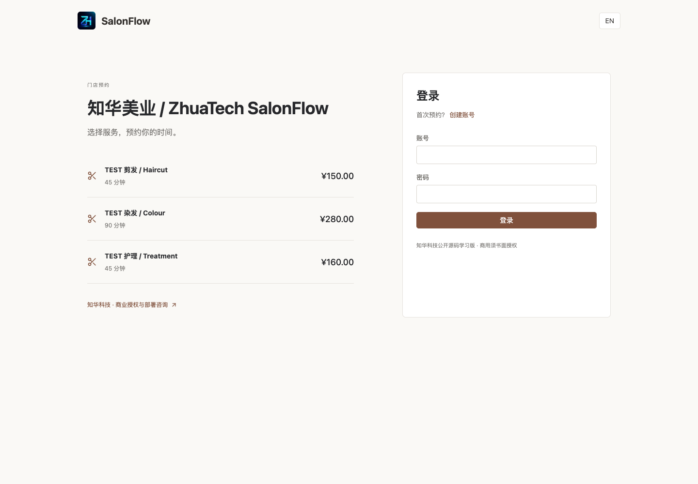
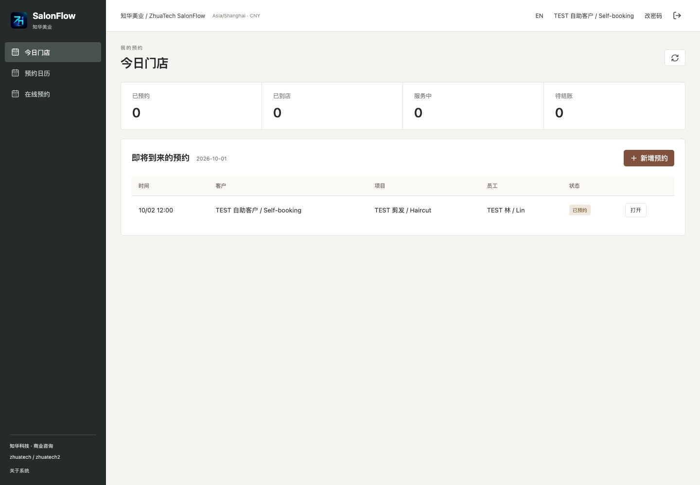
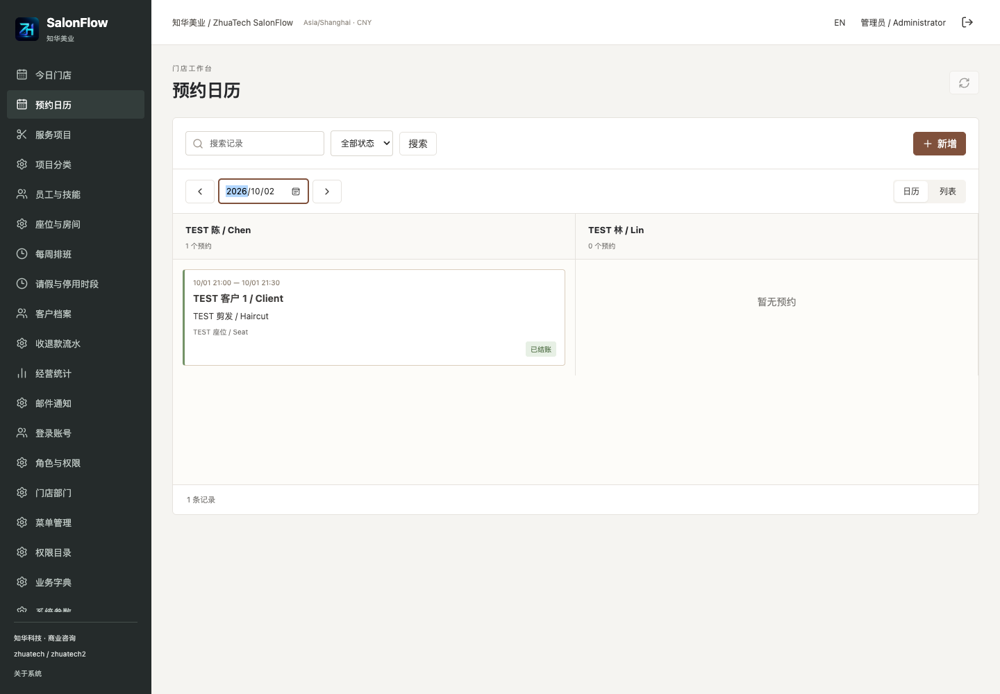
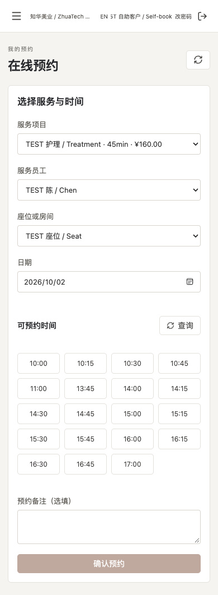
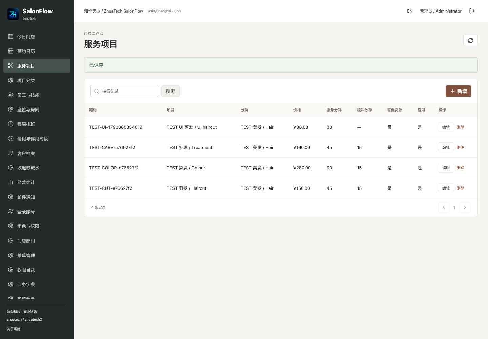
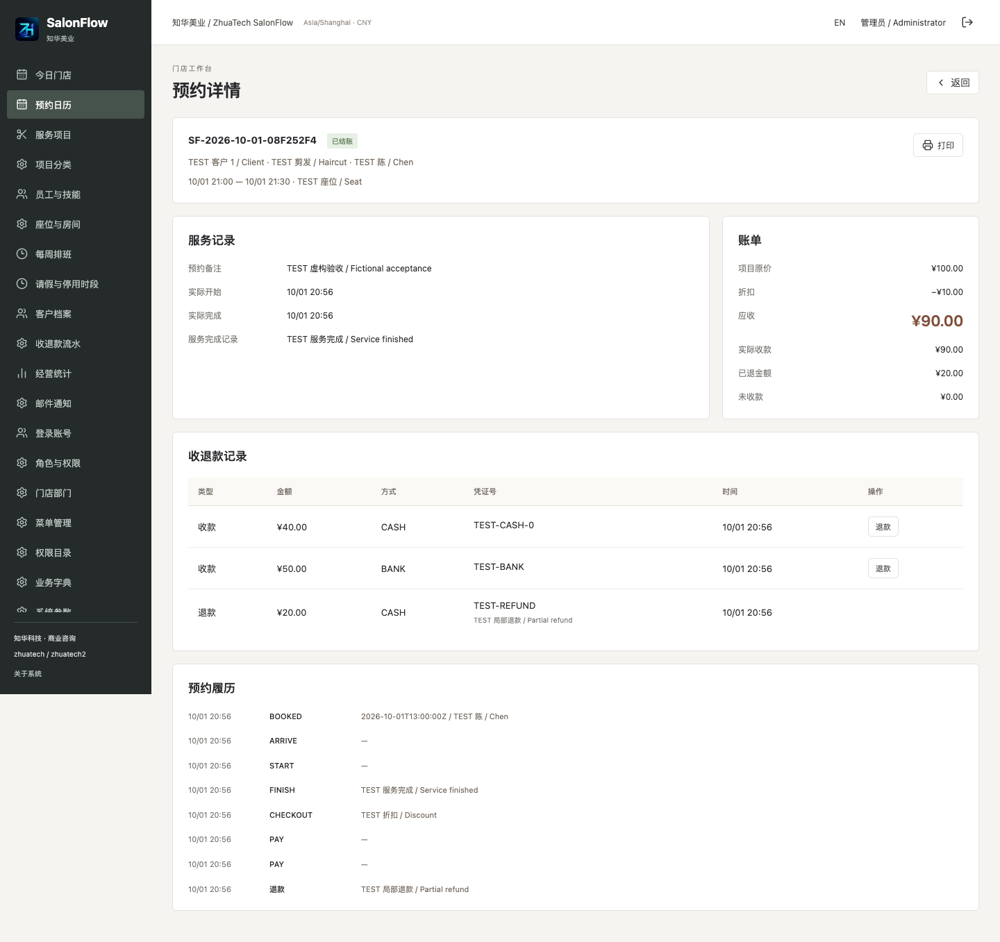
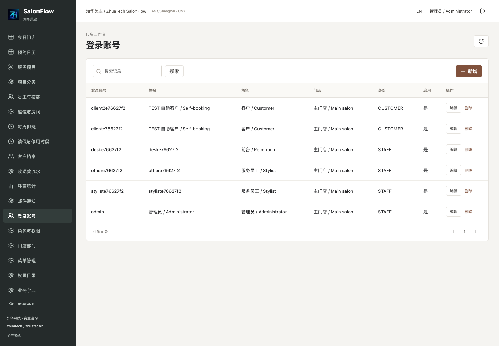
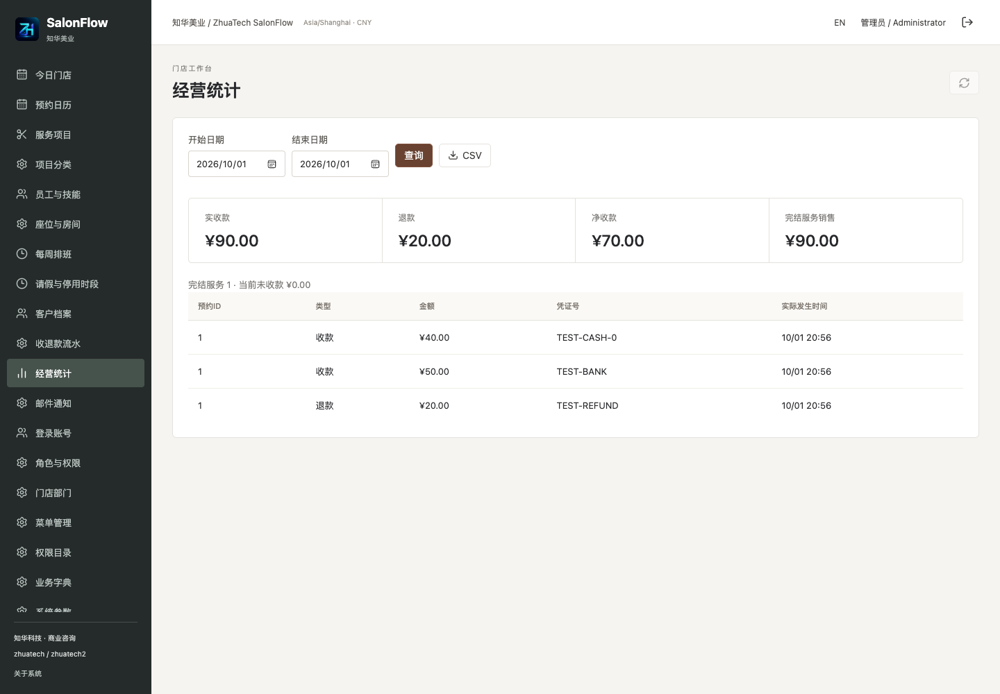
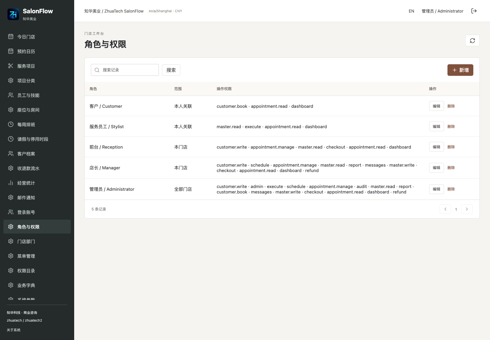
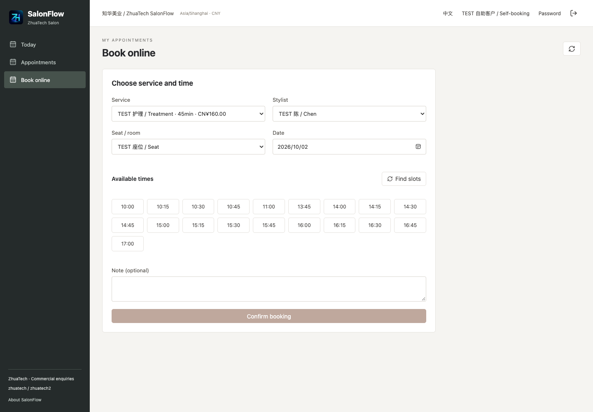

# 知华美业预约经营 · ZhuaTech SalonFlow

**公开源码学习版 1.0.0** — 理发、美甲、美容门店的预约、排班、接待、服务、结账与原单退款。

本项目由知华科技（上海如静知华信息科技有限公司）提供公开源码学习版本，主要用于个人学习、技术研究与非商业交流。未经书面授权不得商用。企业信息化建设、中小企业数字化转型、中小企业 AI 转型、私有化部署、软件外包、软件项目外包、软件实施、FDE 外包、OPC 技术支持及深度定制开发，请访问知华科技官网 https://www.zhuatech.cn/，或添加微信 zhuatech、zhuatech2 咨询。

[English setup and user guide](docs/english-guide.md) · [操作手册](docs/manual.md) · [部署](docs/deployment.md) · [接口](docs/api.md) · [安全](docs/security.md)

SalonFlow is a self-hosted learning edition for salon appointments, staff schedules, client self-booking, reception, service execution, split payments and original-payment refunds. The operating screens support Chinese and English. The custom license allows personal learning and non-commercial research; **commercial use, paid deployment and resale require written authorization** from ZhuaTech. This is source-available software, not an OSI-approved open-source license.

## 从预约到实收

适合需要自有预约入口的美业门店，以及学习或评估私有部署、品牌定制的开发人员。前台安排客户，服务员工处理自己的预约，客户通过手机注册和选择真实可用时间。

一笔预约只安排 **一个服务项目、一个员工、一个可选房间或座位**。可用时间同时检查员工技能、周排班、休息、请假、资源停用、其他预约、服务后缓冲及客户本人撞期。

```text
客户自助 / 前台预约 → 到店 → 员工开始服务 → 服务完成 → 核价 → 收款 → 已结账
       ↓ 改期、取消、未到店                           ↓ 分笔收款       ↓ 原收款退款
```

预约锁定价格、时长和缓冲快照；以后改菜单不会改旧单。预约金额不计作收入。经营报表分别显示实际收款、实际退款、净收款、完成服务金额和未收余额。退款追加不可变流水，不删除原单，也不改原服务金额。

| 模块 | 已实现的实际操作 |
|---|---|
| 客户端 | 自助注册、登录、服务与员工选择、日期和可用时段、本人预约、改期/取消、联系方式和邮件同意、修改密码 |
| 日程与接待 | 按员工的单日日程、列表查询、搜索/状态筛选/排序/分页、代客预约、签到到店、未到店、重新分派 |
| 服务 | 服务分类、项目价格/时长/缓冲、员工技能、关联账号、本人开始和完成服务、服务记录 |
| 排班与容量 | 每员工每日一段周排班及一段休息、请假、房间/座位暂停、占用冲突、进行中服务持续占用 |
| 结账 | 折扣及原因、零价服务、现金/银行转账/外部支付的人工登记、分笔收款、超收校验、原收款逐笔退款 |
| 客户档案 | 联系信息、备注、邮件同意、启停、1–500条 JSON 原子导入 |
| 通知 | 持久化确认/改期/取消邮件队列、24小时前提醒、旧版本取消、同意检查、失败重试和结果查询 |
| 经营 | 门店日期范围报表、收退款明细 CSV、原单打印、首页今日状态和待服务预约 |
| 系统管理 | 用户、角色、权限、菜单、部门/门店、数据范围、付款字典、系统参数、业务事件和审计 |

**边界**：未实现多项目套餐、会员储值/积分/次卡、库存采购、工资提成、跨门店资源共享、平台入驻市场、短信、WhatsApp、税务发票或支付网关。外部支付仅记录已经核实的支付结果，不会发起扣款；SMTP 接受不等于客户收到或阅读。详情见 [功能与配置边界](docs/manual.md#功能边界)。没有 AI 模型依赖。

## 当前运行页面

以下截图来自本版本在全新 MySQL 数据库上的实际运行，所示 TEST 档案及交易均为虚构验收数据。

| 登录与客户入口 | 客户首页 |
|---|---|
|  |  |

| 按员工日程 | 客户手机预约 |
|---|---|
|  |  |

| 服务项目管理 | 服务原单与收退款 |
|---|---|
|  |  |

| 后台账号 | 经营报表 |
|---|---|
|  |  |

| 角色和数据权限 | English operating screen |
|---|---|
|  |  |

## 运行

Docker Engine 与 Compose v2 可直接运行，无需本机 Java 或 Node。默认端口仅绑定本机，初始业务数据库为空。

```sh
python3 scripts/init-env.py
# 从私有 .env 文件读取 ADMIN_PASSWORD；脚本拒绝覆盖已有文件。
docker compose up -d --build --wait
```

打开 http://127.0.0.1:8100/；健康检查 http://127.0.0.1:8100/actuator/health。

默认管理员用户名 `admin`，密码为脚本随机生成的 `.env` 中 `ADMIN_PASSWORD`，**无公开通用密码**。密码需12–72字符，包含大小写字母与数字。首次启动创建管理员、五种角色、权限、菜单、付款方式和门店参数；不会创建虚构收入或预约。`SEED_DEMO=true` 仅增加标明 DEMO 的示例服务和座位，仍需创建员工及排班。初始化参数只在空库生效；已有账号修改使用后台或个人改密码。

管理员先配置门店名称、时区与货币，再建服务分类/项目、服务员工账号、员工技能、周排班及资源。已有预约后时区和货币不能变更。自助客户只会得到固定客户角色，不能注册成管理员。

端口冲突在 `.env` 设 `WEB_PORT=18100`；不要停止其他项目容器。完整环境变量、HTTPS、开发启动、备份和恢复见 [部署手册](docs/deployment.md)。演示版默认启用客户注册，可在系统参数中关闭。

## 工程与数据库

```text
backend/          Java API、认证、业务规则、邮件队列及测试
  src/main/resources/db/migration/V1__salon_schema.sql
frontend/         Vue 业务端与管理端，中文/英文，Nginx /api 代理
scripts/          私有环境初始化、真实 HTTP 验收、发布检查
docs/             部署、架构、数据库、接口、操作、安全、测试、截图及第三方声明
compose.yaml      健康依赖与 MySQL 持久化卷
LICENSE           自有源码的非商业许可
```

后端：Java 21、Spring Boot 4.0.7、Spring Security、JPA、Flyway、BCrypt、SMTP。前端：Node.js 24.19.0、Vue 3.5.40、Vite 8.1.5、Lucide 图标。数据库：MySQL 8.4（MySQL 8 系列），MariaDB JDBC 3.5.10，Docker Compose、Nginx 1.29。

同源 Session + CSRF，服务端实时检查账号、角色和范围。数据库以 UTC 保存时间、门店时区显示；金额使用两位十进制。读已提交隔离和部门配置锁保护容量与收退款，修订号拦截过期页面，命令指纹防重复落单或收款。数据库外键保护历史。详见 [架构](docs/architecture.md) 与 [数据库/迁移](docs/database.md)。单实例面向小门店；列表单实体最多读取10,000条，超限明确拒绝，日历单日最多展示100条，不适合大规模多租户运营。

数据库名 `zhuatech_salonflow`，完整表结构与索引在版本迁移文件。**不要修改已经执行的迁移**：升级前备份，新增 `V2__*.sql`，测试恢复及升级，然后重新构建启动。应用以 `ddl-auto=validate` 核对实体，不会自动乱改表。

## 测试与部署验收

```sh
mvn -B -f backend/pom.xml spotless:check test package
cd frontend
npm ci --no-audit --no-fund
npm run format:check
npm run lint
npm test
npm run build
cd ..
docker compose config --quiet
docker compose build
python3 scripts/release-check.py
git diff --check
```

真实接口验收会写入标明 TEST 的虚构数据，仅对可丢弃测试数据库运行：

```sh
python3 scripts/smoke.py --base http://127.0.0.1:8100 --env .env --allow-test-writes
```

测试覆盖撞期、缓冲、价格时长快照、状态、并发收款、幂等、超收、超退、账号停用、客户/员工隔离、原子导入、夏令时、邮件接受与失败。H2 集成测试不能替代 MySQL 验收。实际结果、部署及故障检查见 [测试说明](docs/testing.md)。镜像构建正常执行测试，没有跳过测试。

## 安全、反馈与贡献

公开部署需 HTTPS、`COOKIE_SECURE=true`、唯一强密码、限制注册与请求频率，并定期备份。不得把 `.env`、真实客户资料、数据库备份、Cookie 或未脱敏日志提交。管理员修改账号或密码会使不再符合授权的旧会话失效；链接客户/员工身份的账号不能随意改角色、用户名或门店。浏览器刷新后的业务状态以服务器为准。

功能问题请在本仓库 Issues 描述操作步骤、版本和脱敏报错。安全漏洞通过下方官网或微信私下联系，勿公开凭证或客户数据。贡献先提出明确问题，提交小范围变更和相应验证，保留公司署名、许可及第三方版权。贡献代码需有适用权利，不得提交客户代码或数据。详见 [安全说明](docs/security.md)。

学习版须由部署者评估业务适配、备份、服务可用性和当地要求；未提供任何真实客户案例、市场验证、认证或上线保障。第三方版权独立适用，见 [第三方声明](docs/third-party.md)。

## 联系知华科技

本项目为公开源码学习版，仅限个人学习、技术研究与非商业交流。商用、收费部署、企业交付、SaaS运营、二次销售或商业培训须取得书面授权，以根目录 [LICENSE](LICENSE) 为准。

- 公司：上海如静知华信息科技有限公司
- 官网：https://www.zhuatech.cn/
- 商业授权、定制开发、私有化部署与系统集成：微信 **zhuatech**、**zhuatech2**

<table>
<tr>
<td align="center"><br>微信：zhuatech</td>
<td align="center"><br>微信：zhuatech2</td>
</tr>
</table>
